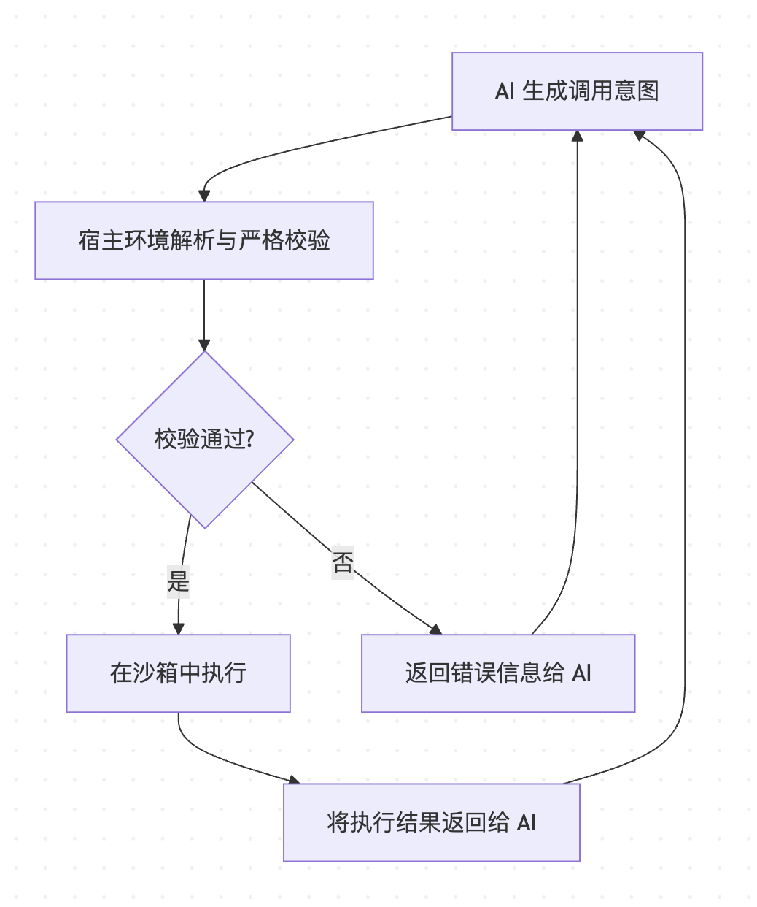

## 引言：从“聊天机器人”到“自主智能体”

一个聊天机器人，其核心是“对话”；而一个 AI Agent，其核心是“行动”。

Agent 不仅仅是与你对话，它被赋予了明确的 **目标 (Goal)**，并能自主地 **规划 (Planning)**、调用 **工具 (Tools)**，最终完成任务。它是一个能够感知环境、进行决策并采取行动的自主系统。

要构建一个稳定、可靠、可进化的 Agent，我们不能满足于零散的技巧堆砌，而需要一个清晰的、可扩展的 **系统架构**。

## 第一部分：AI Agent 的核心架构：感知、大脑、行动与记忆

一个生产级的 AI Agent，无论其应用场景多么复杂，其核心架构都可以抽象为四个关键组件的协同工作：



1.  **感知层 (Perception)**：Agent 的“五官”，负责接收和理解来自外部世界的原始输入。
2.  **大脑层 (Brain)**：Agent 的“中央处理器”，是决策的核心。它负责理解意图、制定计划、选择工具。
3.  **行动层 (Action)**：Agent 的“双手”，负责执行大脑的决策，与外部世界进行交互。
4.  **记忆层 (Memory)**：Agent 的“海马体”，负责存储和检索信息，为决策提供上下文。

接下来的内容，我们将逐一拆解这四大组件的设计要点和工程实践。

## 第二部分：大脑层 (Brain) - Agent 的决策中枢

“大脑”是 Agent 的灵魂，其核心是 **一个以 LLM 为基础的推理引擎**。它的主要职责是执行一个持续的 **推理-行动循环 (ReAct Cycle)**，这个循环由三个关键任务构成：

#### **1. 意图理解 (Intent Recognition)**

当“感知层”传来用户的请求时，“大脑”的首要任务不是立刻行动，而是深入理解其背后的真实意图。

*   **实践**：利用 LLM 强大的自然语言理解能力，对用户模糊的、口语化的请求进行分析、澄清和结构化。例如，将 `“帮我搞定下周去上海的出差事宜”` 转化为一个结构化的任务描述：
    ```json
    {
      "task": "arrange_business_trip",
      "destination": "上海",
      "timeframe": "next_week",
      "constraints": ["budget_conscious", "prefers_window_seat"]
    }
    ```

#### **2. 任务规划 (Task Planning)**

理解意图后，“大脑”需要将一个复杂的目标，拆解为一系列可执行的、更小的子任务。

*   **实践**：在主提示 (Meta-Prompt) 中，明确要求模型首先进行思考和规划 (`Thought: ...`)。对于复杂任务，可以引入更高级的规划策略，如 **Plan-and-Execute**，让模型先生成一个完整的、可修改的计划，然后再逐一执行。
    ```
    Thought: 用户需要规划一次去上海的出差。计划如下：
    1. 查询未来一周从北京到上海的往返机票。
    2. 根据机票时间，预订一家在市中心、价格适中的酒店。
    3. 预订一个靠窗的座位。
    4. 将最终行程发送给用户确认。
    第一步，我需要调用机票查询工具。
    ```

#### **3. 工具选择 (Tool Selection)**

对于计划中的每一个子任务，“大脑”需要从“行动层”提供的工具库中，选择最合适的一个来执行。

*   **实践**：在主提示中，清晰地描述每一个可用工具的名称、功能和参数 (JSON Schema)。LLM 会基于这个“工具手册”和当前的子任务，生成一个结构化的工具调用指令 (Function Calling)。

这三个步骤——**理解、规划、选择**——构成了“大脑”的核心决策链，而 ReAct 框架正是驱动这条链条运转的基础引擎。

## 第三部分：行动层 (Action) - 连接现实世界的桥梁

如果说“大脑”负责决策，那么“行动层”就是将决策付诸实施的执行者。它由一系列定义清晰、安全可靠的 **工具 (Tools)** 组成。

构建“行动层”的核心原则是：**不信任**。永远不要直接执行 LLM 生成的任何代码或命令。LLM 的角色是“提议”一个行动，而开发者必须构建一个坚固的“审查和执行”流程。

这个流程包含四个关键步骤：

1.  **生成 (Generate)**：LLM 根据其“思考”，生成一个结构化的工具调用 JSON。
2.  **校验 (Validate)**：宿主程序 (Host Program) 收到这个 JSON 后，必须使用 Pydantic、Zod 等库，根据预定义的 Schema 进行严格的 **语法和业务逻辑校验**。这包括类型、格式、范围、权限等。
3.  **执行 (Execute)**：只有校验通过后，才调用相应的函数。所有敏感操作（文件、网络、代码）都必须在 **沙箱环境** (如 Docker, WASM) 中执行，以隔离风险。
4.  **响应 (Respond)**：将工具的执行结果（成功数据或失败错误）封装成 `Observation`，返回给“大脑”，作为其下一轮思考的输入。

**特别注意：所有工具的设计都必须是幂等的。** 对于创建或修改数据的操作，要通过唯一的请求 ID 或业务逻辑检查，确保重复的请求不会产生副作用。

## 第四部分：记忆层 (Memory) - 赋予 Agent 上下文感知能力

一个没有记忆的 Agent 无法进行连贯的对话，也无法从过去的经验中学习。记忆层是 Agent 摆脱“金鱼脑”的关键。

#### **1. 短期记忆 (Short-term Memory)**

*   **作用**：维持当前任务的上下文连贯性。
*   **实现**：通常是一个存储了当前对话所有 `Thought → Action → Observation → Answer` 完整历史的列表或缓冲区。
*   **挑战**：随着对话轮次增多，上下文窗口会迅速被填满，导致成本增加和性能下降。
*   **策略**：
    *   **滑动窗口 (Sliding Window)**：只保留最近的 N 轮对话。
    *   **摘要 (Summarization)**：当历史过长时，用一个 LLM 调用将其总结为一段更短的摘要。

#### **2. 长期记忆 (Long-term Memory)**

*   **作用**：为 Agent 提供超越当前对话的、持久化的背景知识和经验。
*   **实现**：通常由 **向量数据库 (Vector Database)** 实现。
    1.  **存储**：当任务完成或获得重要信息时，将其转化为 Embedding 向量，存入向量数据库。
    2.  **检索**：在“大脑”进行任务规划时，将当前的意图和子任务转化为 Embedding，去向量数据库中进行相似度搜索，检索出相关的历史经验或知识。
*   **应用**：
    *   `“我上次为这位客户预订酒店时，他特别强调了需要一个安静的房间。”`
    *   `“之前处理类似的数据库查询任务时，直接使用 `JOIN` 语句会导致超时，最好分两步查询。”`

通过短期记忆和长期记忆的结合，“大脑”在做决策时，就不仅拥有了“当前任务的上下文”，还拥有了“过去所有经验的智慧”。

## 第五部分：Agent 的进化：评估与容错

一个健壮的 Agent 系统，必须包含一套完善的自我进化和容错机制。

#### **1. 评估 (Evaluation)**

*   **核心指标**：`结构化正确率` 和 `任务成功率`。
*   **实践**：建立一个覆盖核心场景的 **端到端回归测试集**。每次变更（模型、提示、工具）后，自动运行测试集，并使用一个更强的 LLM（如 GPT-4o）作为“AI 裁判”，根据预设的评估维度 (Rubrics) 对 Agent 的表现进行打分，确保系统的核心能力没有衰退。

#### **2. 容错 (Fault Tolerance)**

*   **带修复指令的重试**：当校验失败或工具执行出错时，不要直接放弃。将详细的错误信息作为 `Observation` 反馈给“大脑”，让它“反思”并自我修正。
    ```
    Observation: 工具 'search_hotel' 执行失败。错误信息：参数 'check_in_date' 的格式 '下周一' 无效，必须是 'YYYY-MM-DD' 格式。
    ```
*   **优雅降级**：对于多次重试仍失败的不可恢复错误，应有降级方案，如转交人工处理、返回友好的错误提示等。

## 结论：AI Agent 是一个工程系统

构建一个生产级的 AI Agent，本质上是一项严肃的系统工程。它需要我们将 LLM 视为一个强大的、但有不确定性的“组件”，并围绕它构建起一套包含 **感知、大脑、行动、记忆** 的完整架构。

在这个架构中，我们通过严格的 **结构化输出** 和 **沙箱化执行** 来保证“行动”的可靠性，通过 **短期与长期记忆** 来赋予“大脑”上下文感知能力，并通过 **持续的评估与容错** 来驱动整个系统的稳定进化。

这套工程化的方法论，是我们将 AI 从有趣的“对话伙伴”转变为可靠的“自主员工”的必经之路。
