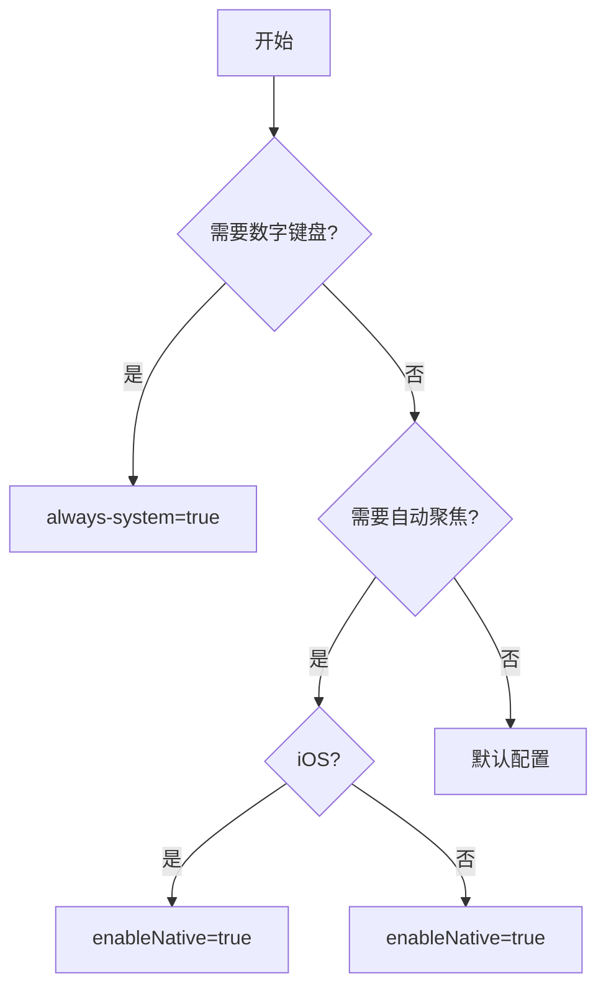

> **一句话总结**：理解三种实现方式，按场景选择配置，避开15个常见坑。

## 📋 快速上手

| 场景 | 推荐配置 | 一句话说明 |
|------|----------|------------|
| **普通文本** | 无需配置 | 默认半同层，够用 |
| **数字/金额** | `always-system="{{true}}"` | 原生键盘，不踩坑 |
| **身份证** | iOS全同层，Android原生 | 平台差异化处理 |
| **弹窗输入** | iOS全同层，Android半同层 | 解决focus问题 |

---

## 一、核心原理：3种实现方式

### 1.1 实现方式对比表

| 实现方式 | iOS | Android | 适用场景 | 优缺点 |
|----------|-----|---------|----------|--------|
| **原生W3C** | ✅ | ✅ | 数字键盘 | ✅标准兼容 ❌功能有限 |
| **半同层** | ✅ | ✅ | 默认选择 | ✅平衡体验 ❌偶有漂移 |
| **全同层** | ✅ | ❌ | iOS复杂交互 | ✅完全控制 ❌配置复杂 |

### 1.2 同层渲染原理（一句话理解）
- **iOS**：WKWebView生成独立图层承载原生组件
- **Android**：WebPlugin挖孔技术实现同层渲染

---

## 二、场景化配置（直接抄）

### 2.1 基础场景（90%情况）

```html
<!-- 普通文本输入 - 无需特殊配置 -->
<input placeholder="请输入用户名" value="{{value}}" />
```

### 2.2 数字场景（推荐原生）

```html
<!-- 金额、手机号、验证码 -->
<input type="number" always-system="{{true}}" placeholder="请输入手机号" />
```

### 2.3 身份证场景（平台差异）

```html
<!-- iOS：全同层（需配置app.json） -->
<input type="idcard" enableNative="{{true}}" />

<!-- Android：原生 -->
<input type="idcard" always-system="{{true}}" />
```

### 2.4 弹窗场景（自动聚焦）

```html
<!-- iOS：全同层解决focus无效 -->
<input focus="{{autoFocus}}" enableNative="{{true}}" />

<!-- Android：半同层即可 -->
<input focus="{{autoFocus}}" enableNative="{{true}}" />
```

---

## 三、配置决策树（30秒选对）



---

## 四、15个常见坑及解决方案

### 🔴 样式问题
| 问题 | 现象 | 解决方案 |
|------|------|----------|
| **disabled颜色异常** | iOS同层下颜色不对 | 用view替代或设置color样式 |
| **字体不一致** | focus/blur字体不同 | 强制font-family |

### 🔴 事件问题
| 问题 | 现象 | 解决方案 |
|------|------|----------|
| **过滤失效** | 输入7显示567 | 使用微任务延迟过滤 |
| **多次触发** | 中文输入触发多次 | debounce防抖处理 |

### 🔴 光标问题
| 问题 | 现象 | 解决方案 |
|------|------|----------|
| **光标漂移** | 输入时光标偏移 | 固定位置或平台判断 |
| **focus无效** | iOS下focus不生效 | 使用全同层或延迟聚焦 |

### 🔴 键盘问题
| 问题 | 现象 | 解决方案 |
|------|------|----------|
| **页面无法恢复** | 键盘收起页面不回位 | 监听键盘高度变化 |
| **弹窗被遮盖** | 弹窗输入被键盘顶起 | 添加padding或scroll-view |

---

## 五、万能组件模板（直接复制）

### 5.1 智能输入组件

```javascript
// components/smart-input/index.ts
Component({
  props: {
    type: { type: String, value: 'text' },
    keyboardType: { type: String, value: 'text' },
    focus: Boolean
  },
  
  data: {
    platform: 'android',
    config: {}
  },
  
  didMount() {
    const platform = my.getSystemInfoSync().platform.toLowerCase();
    const config = this.getConfig(platform, this.props.keyboardType);
    this.setData({ platform, config });
  },
  
  methods: {
    getConfig(platform, keyboardType) {
      // 数字类输入统一用原生
      if (['number', 'digit', 'idcard'].includes(keyboardType)) {
        return { alwaysSystem: true };
      }
      
      // iOS弹窗用全同层
      if (platform === 'ios' && this.props.focus) {
        return { enableNative: true };
      }
      
      // 其他用默认
      return {};
    }
  }
});
```

### 5.2 使用示例

```html
<!-- 基础文本 -->
<smart-input placeholder="请输入用户名" />

<!-- 手机号 -->
<smart-input type="number" keyboardType="number" placeholder="请输入手机号" />

<!-- 弹窗输入 -->
<smart-input focus="{{true}}" placeholder="请输入内容" />
```

---

## 六、调试工具包

### 6.1 平台判断工具

```javascript
// utils/platform.js
export const Platform = {
  isIOS: () => my.getSystemInfoSync().platform === 'iOS',
  isAndroid: () => my.getSystemInfoSync().platform === 'Android',
  
  // 一键获取推荐配置
  getInputConfig(type = 'text') {
    const isIOS = this.isIOS();
    
    if (['number', 'digit', 'idcard'].includes(type)) {
      return { alwaysSystem: true };
    }
    
    return isIOS ? { enableNative: true } : {};
  }
};
```

### 6.2 调试检查清单

- [ ] 字体统一（设置font-family）
- [ ] 数字输入用原生键盘
- [ ] 弹窗输入测试focus
- [ ] 键盘收起页面恢复
- [ ] 平台差异测试

---

## 七、版本兼容

### 7.1 新特性检测
```javascript
// 检测新同层方案
const canUseNew = my.canIUse('input.system-keyboard');
```

### 7.2 兼容性处理
```javascript
// 向后兼容处理
const config = Platform.getInputConfig('number');
// 自动适配新旧版本
```

---

## 八、一句话总结

**记住这个公式**：
- 数字输入 → `always-system=true`
- iOS弹窗 → `enableNative=true`
- 其他情况 → 默认配置

**开发口诀**：简单用默认，数字用原生，iOS 弹窗用全同层，Android 保持简单。

---

## 📚 附录：完整配置对照表

| 场景描述 | iOS配置 | Android配置 | 一句话理由 |
|----------|---------|-------------|------------|
| 普通文本输入 | 默认 | 默认 | 半同层够用 |
| 金额输入 | always-system=true | always-system=true | 原生数字键盘 |
| 手机号输入 | always-system=true | always-system=true | 避免兼容问题 |
| 身份证输入 | enableNative=true | always-system=true | 平台差异最优 |
| 弹窗自动聚焦 | enableNative=true | enableNative=true | 解决focus问题 |
| 复杂光标控制 | enableNative=true | always-system=true | 精确控制需求 |

现在你可以根据场景直接选择配置，无需记忆复杂原理！
